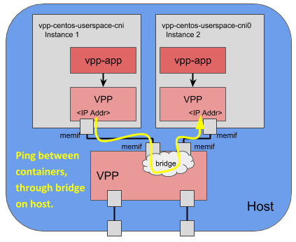

# Welcome to NFV Features in Kubernetes: A hands-on Tutorial!

Thanks for joining us at ONS Europe 2018 to try out some NFV features in Kubernetes. 

Agenda:

* Workstation setup
* Multus CNI
* SR-IOV Device Plugin (emulated)
* Userspace CNI
* Additional & Reference Materials

## Requirements

All you need is an SSH client. Please feel free to use whatever you have. If you'd like, you can use a [Chrome Extension for SSH](https://chrome.google.com/webstore/detail/secure-shell-app/pnhechapfaindjhompbnflcldabbghjo?hl=en).

## Workstation setup

Let's get setup to use our workstation! At each of your desks, you'll have a number. The speakers will provide you with a link to visit. Visit that link.

Here you'll be presented with a table with a number, use the SSH connection string as provided and you'll wind up on the machine. Do you notice that there's 2 SSH links? One is a backup in case you type `exit` -- generally, don't type `exit`! If you do by accident (or, more likely, out of habit), you can use the second one. 

First things first! Let's make a new tmux window.

```
ctrl+b [release the keys, then hit] c
```

This provides us a layer of redundancy in case someone types `exit`. Need more help with tmux? Try the [tmuxcheatsheet.com](https://tmuxcheatsheet.com/).

Now! Let's make sure that no one else is accidentally using our instance! We'll use the `wall` command to announce our name.

```
wall Hello this is My Name
```

Make sure to type your own name. If you see someone else's name appear -- let's figure out who used the wrong link.

Now! Let's make sure you can access the kubernetes cluster, let's list the available nodes...

```
kubectl get nodes
```

You should see the master and a node, and the `STATUS` should read `NotReady` -- this is where we want it, these nodes won't be ready until we install our pod-to-pod network. That's what's we're going to do next, let's roll!

## Multus CNI

### Core Concepts

* CRDs - Custom Resource Definitions
    - How we extend the Kubernetes API, and define custom configurations for each network/NIC we attach to our pods
* "Default network"
    - Our "default network" is the configuration that we use that is the default NIC attached to each and every pod in our cluster, typically this is used for pod-to-pod communication.

### A1. Inspecting the Multus daemonset-style installation

Inspect your work area, firstly, list your home directory, You'll see there's a `./multus-cni`. Move into that directory

```
ls -l
cd multus-cni
```

Typically, by default we setup using the "quick start guide" method, which deploys a YAML file with a daemonset and some CRDs.

Let's look at that file.

```
cat images/multus-daemonset.yml
```

Taking a look around, you'll see this is comprised of a few parts -- each between the `---` YAML delimiter.

* A CRD (Custom Resource Definition)
    - This defines how we'll extend the Kubernetes API with our custom configurations for how we'll setup each NIC attached to our pods.
* A cluster role, cluster role binding and service account
    - to give Multus permissions to access the Kubernetes API
* A config map
    - Currently unused, but to allow you to customize how Multus is configured
* A Daemonset
    - A way to define a pod that runs on each host in our cluster, in this case it is used to place our Multus binary and flat file configuration on each machine in the cluster.

### A2. Install Multus and the default network

Let's take this for a spin -- we'll deploy both the Multus Daemonset, and Flannel, which will be used for our "default network" -- 

```
cat ./images/{multus-daemonset.yml,flannel-daemonset.yml} | kubectl apply -f -
```

This is going to spin up a number of pods, let's watch it come up...

```
kubectl get pods --all-namespaces -w
```

Or if you don't like that format, you can use `watch` itself...

```
watch -n1 kubectl get pods --all-namespaces -o wide
```

### A3. Verify the installation of Multus & default network

Next, we can check that state of our nodes, once everything is running we should see that `STATUS` changes from `NotReady` to `Ready` -- 

```
kubectl get nodes
```

This state is determined by the Kubelet by looking for the precence of a CNI configuration in the CNI configuration directory -- by default this is `/etc/cni/net.d`, and this holds true for our configuration as well.

Let's take a look there.

```
cat /etc/cni/net.d/70-multus.conf
```

Looking at this configuration file, you'll see that there's a number of things configured here, for example:

* `delegates`: This defines our default network, in this case we "delegate" the work for the default network to Flannel, which we use in this scenario as a pod-to-pod network.
* `type`: This is a required CNI configuration field, and in each place that you see `type` that means that CNI is going to call the binary (by default in `/opt/cni/bin`) of the value of `type`, in this case the top level `type` is set to `multus` which is what we want to be called first -- then in the `delegates` section we have it the `type` set to `flannel`, in this case Multus is what calls this binary, and it will be the first binary called and always attached @ `eth0`.

### A4. Run a pod without additional interfaces

Let's start a "vanilla" pod, this is kind of the control in our experiment here.

```
cat <<EOF | kubectl create -f -
apiVersion: v1
kind: Pod
metadata:
  name: vanillapod
spec:
  containers:
  - name: vanillapod
    command: ["/bin/bash", "-c", "sleep 2000000000000"]
    image: dougbtv/centos-network
EOF
```

Watch that come up...

```
kubectl get pods -w
```

Once it shows `Running` in the `STATUS`, let's execute a command in that pod...

```
kubectl exec -it vanillapod -- ip -d a
```

Take a look at the output, you'll see two interfaces -- one doesn't count! The loopback! And you'll also see a `eth0` -- this one is attached to the Flannel network. In this case, it's in a `10.244.0.0/8` address.

### A5. Create a new CNI configuration stored as a custom resource

Now, let's setup a custom network we'll attach as a second interface to a different pod.

```
cat <<EOF | kubectl create -f -
apiVersion: "k8s.cni.cncf.io/v1"
kind: NetworkAttachmentDefinition
metadata:
  name: macvlan-conf
spec: 
  config: '{
      "cniVersion": "0.3.0",
      "type": "macvlan",
      "master": "eth0",
      "mode": "bridge",
      "ipam": {
        "type": "host-local",
        "subnet": "192.168.1.0/24",
        "rangeStart": "192.168.1.200",
        "rangeEnd": "192.168.1.216",
        "routes": [
          { "dst": "0.0.0.0/0" }
        ],
        "gateway": "192.168.1.1"
      }
    }'
EOF
```

What did we just do here? Remember how we looked at the `/etc/cni/net.d/70-multus.conf` -- that's a CNI configuration file. In that case we configured Multus itself. But, since Multus is a "meta plugin" and it calls other plugins, we're creating another different CNI plugin. In this case we created a configuration for using the `macvlan` plugin. 

Where does this get stored? You can look for it using the command line (or the Kubernetes API, as well)

Let's take a look:

```
kubectl get crds
```

Here we can see the over-arching namespace under which these configurations live, in this case our namespace is called `network-attachment-definitions.k8s.cni.cncf.io`. 

You can take a look and see what's available for custom resources created under that umbrella.

You can do that with:

```
kubectl get network-attachment-definitions.k8s.cni.cncf.io
```

Here we can see that `macvlan-conf` has been created. That's the name we gave it above. 

We can implement an attachment to this `macvlan-conf` configured network by referencing that name in an annotation in another pod. Let's create it. Take a look closely here and see that there is an `annotations` section -- in this case we call out the namespace under which it lives, and then the value of the name of the custom resource we just created, which reads as: `k8s.v1.cni.cncf.io/networks: macvlan-conf`

### A6. Create a pod with an additional interface

Let's move forward and create that pod:

```
cat <<EOF | kubectl create -f -
apiVersion: v1
kind: Pod
metadata:
  name: multipod
  annotations:
    k8s.v1.cni.cncf.io/networks: macvlan-conf
spec:
  containers:
  - name: multipod
    command: ["/bin/bash", "-c", "sleep 2000000000000"]
    image: dougbtv/centos-network
EOF
```

Watch the pod come up again...

```
kubectl get pods -w
```

### A7. Verify the interfaces available in the pod

And when it comes up, now we can take a look at the interfaces that were created and attached to that pod:

```
kubectl exec -it multipod -- ip -d a
```

Now we can see that there are three interfaces!

* A loopback
* `eth0` attached to our default network (flannel)
* `net1` attached to our macvlan network we just created.

## SR-IOV Device Plugin

We're going to explore the use of a device plugin for 

In this case -- we're emulating the experience using [virt-network-device-plugin](https://github.com/zshi-redhat/virt-network-device-plugin#quick-start). In reality you'll be using the [sriov-network-device-plugin](https://github.com/intel/sriov-network-device-plugin) when you go to plumb SR-IOV devices into your pods.

Due to hardware/space/etc constraints in this tutorial setting -- we couldn't have SR-IOV hardware available for everyone. So instead this `virt-network-device-plugin` uses `virtio` devices instead. Each of the nodes you're using is a virtual machine, and has an additional virtio device that can be used by this emulated SR-IOV device plugin.

### Core Concepts

* Scheduler awareness of hardware
  - The reason that you can't "just use a CNI plugin" is that, while it'll probably work for a one-off test in your lab -- in production, a CNI plugin alone doesn't have scheduler awareness. The device plugin gives you a way to tell the Kubernetes scheduler that there are resources available on a particular node.
* [ehost-device CNI plugin](https://github.com/zshi-redhat/ehost-device-cni)
  - This is an enhanced version of the [host-device](https://github.com/containernetworking/plugins/tree/master/plugins/main/host-device) reference CNI plugin that allows for IPAM (IP Address Management) to be used as well.
* Custom Kubernetes Build
  - This currently requires a patch that's in progress for Kubernetes. 
  - The cluster that you're currently using is based on a custom build of Kubernetes using this patch.
  - The patch is avaible [on GitHub](https://github.com/kubernetes/kubernetes/compare/master...dashpole:device_id#diff-bf28da68f62a8df6e99e447c4351122).
* Multus CNI
  - Multus is used here in order to have this pod both plumbed to the "default network", and to have the additional 

### B1. Create the CNI configuration for the ehost-device plugin

Let's first create the CRD object for this, similarly to Multus.

If you're root, exit from the root user. Move into the local clone, as non-root user.

```
cd ~/virt-network-device-plugin/
```

Create the CRD object.

```
kubectl create -f deployments/virt-crd.yaml
```

You can list it and describe it.

```
kubectl get network-attachment-definitions.k8s.cni.cncf.io
kubectl describe network-attachment-definitions.k8s.cni.cncf.io virt-net1
```

Let's make it so we can run workloads on the master, here's where we'll run the virt-device-plugin itself.

### B2. Starting the device plugin

Now let's spin up the device plugin itself...

```
curl https://gist.githubusercontent.com/dougbtv/8c63c9922e94178649306979ece58694/raw/b2dbbaaa99baeba25d88e4e0d8a8ea02ff1dad67/virtdp-daemonset.yaml | kubectl create -f -
```

Go ahead and list the pods on your cluster, we'll show which nodes they're running on...

```
kubectl get pods -o wide --all-namespaces
```

### B3. Inspecting the discovered devices from the device plugin

Let's look at the logs of that pod on a node...

```
kubectl logs $(kubectl get pods -o wide --all-namespaces | grep kube-virt-device-plugin | grep -i node | head -n1 | awk '{print $2}') --namespace=kube-system
```

### B4. Creating a pod to use the device plugin

Let's spin up a pod...

```
cat <<EOF | kubectl create -f -
apiVersion: v1
kind: Pod
metadata:
  name: virtdevicepod1
  labels:
    env: test
  annotations:
    k8s.v1.cni.cncf.io/networks: virt-net1
spec:
  containers:
  - name: appcntr1
    image: dougbtv/centos-network
    imagePullPolicy: IfNotPresent
    command: [ "/bin/bash", "-c", "--" ]
    args: [ "while true; do sleep 300000; done;" ]
    resources:
      requests:
        memory: "128Mi"
        kernel.org/virt: '1'
      limits:
        memory: "128Mi"
        kernel.org/virt: '1'
EOF
```

### B5. Inspecting the results of the pod using the device

Now we can exec in the pod and see it has plumbed our virtual device into the pod!

```
kubectl exec -it virtdevicepod1 -- ip -d a
```

You'll see two interfaces. `eth0` and `net1` -- where `net1` is the virtual device.

And check out that it's running on the proper node:

```
kubectl get pods -o wide
```

### B6. Review the resources available on the node

And you can find out more about the resources used with:

```
kubectl describe node $HOSTNAME | less
```

### B7. Create a pod that doesn't have a way to get scheduled.

If you create a secondary pod, you can also see that it won't get assigned, and will remain in a pending status:

```
cat <<EOF | kubectl create -f -
apiVersion: v1
kind: Pod
metadata:
  name: virtdevicepod2
  labels:
    env: test
  annotations:
    k8s.v1.cni.cncf.io/networks: virt-net1
spec:
  containers:
  - name: appcntr1
    image: dougbtv/centos-network
    imagePullPolicy: IfNotPresent
    command: [ "/bin/bash", "-c", "--" ]
    args: [ "while true; do sleep 300000; done;" ]
    resources:
      requests:
        memory: "128Mi"
        kernel.org/virt: '1'
      limits:
        memory: "128Mi"
        kernel.org/virt: '1'
EOF
```

## Userspace CNI

In this tutorial we will run the Userspace CNI. The Userspace CNI is used to add userspace networking interfaces to a container. Userspace networking interfaces require special handling because the interfaces are not owned by the kernel, so they cannot be added to a container through normal namespace provisioning. Work needs to be done on the host to created the interface in the local vSwitch, and work needs to be performed in the container to consume the interface. Even though the userspace interfaces require special handling, they are desired because running outside the kernel allows for some software optimizations that produce higher throughput at the cost of higher CPU usage.

The Userspace CNI supports both OVS-DPDK (http://www.openvswitch.org/) and VPP (https://fd.io/), which are both opensource userspace projects based on DPDK (https://www.dpdk.org/). This tutorial uses VPP as the vSwitch (see configuration below, Line 6), but Userspace CNI also supports OVS-DPDK.


In this tutorial, we will create the following:




On the host, the configuration for the Userspace CNI is as follows:
```
# cat /etc/alternate.net.d/90-userspace.conf
{
       "cniVersion": "0.3.1",
       "type": "userspace",
       "name": "memif-network",
       "host": {
               "engine": "vpp",
               "iftype": "memif",
               "netType": "bridge",
               "memif": {
                       "role": "master",
                       "mode": "ethernet"
               },
               "bridge": {
                       "bridgeId": 4
               }
       },
       "container": {
               "engine": "vpp",
               "iftype": "memif",
               "netType": "interface",
               "memif": {
                       "role": "slave",
                       "mode": "ethernet"
               }
       },
       "ipam": {
               "type": "host-local",
               "subnet": "192.168.210.0/24",
               "routes": [
                       { "dst": "0.0.0.0/0" }
               ]
       }
}
```


Based on this configuration data, the Userspace CNI will perform the following steps for each container that is spun up:
* Create a memif interface on the VPP instance on the host (which is a VM in this tutorial). 
* Create a bridge (if it doesn't already exist) on the VPP instance on the host and add the newly created memif interface to the bridge.
* Call the IPAM CNI to retrieve the container IP values.
* Write the container configuration and IPAM results structure to DB.

On container boot, an application in the container (vpp-app) will read the DB and create a memif interface in the container and add the IP settings to interface.

**NOTE:** This tutorial is using a local script to call and exercise the Userspace CNI. In a deployment scenario, the Userspace CNI is intended to run with Multus, which can add multiple interfaces into a container. Multus will handle adding the 'default network' in addition to the userspace interface shown here. The Userspace CNI currently works with Multus and Kubernetes but was omitted here for simplicity and keep the focus on Userspace CNI.

### Core Concepts

* "Userspace networking"
    - Typical packet processing on a linux distribution occurs in the kernel. With "userspace networking", packet processing occurs in software outside the kernel. Software techniques such as processing a batch of packets at a time, poll driven instead of interupt driven, and data/instruction cache optimization can produce higher data rates than pure kernel packet processing.
* vhost-user
    - vhost-user is a protocol that is used to setup virtqueues on top of shared memory between two userspace processes on the same host. The vhost user protocol consists of a control path and a data path. Once data path is established, packets in the shared memory can be shared between the two userspace processes via a fast zero-copy.
    - In userspace networking, a vhost-user interface is created in two userspace processes (between host and vm, between host and container, between two different containers), a unix socket file is shared between them that is used to handshake on the virtual queues back by shared memory.
* memif
    - memif is a protocol similiar to vhost-user, a packet based shared memory interface for userspace processes. Where vhost-user was designed for packet processing between host and virtual machines, with host to guest memory pointer mapping. memif was not and skips this step. This and other optimizations makes memif faster than vhost-user for host to container or container to container packet processing.
    - In userspace networking, a memif interface is created in two userspace processes (between host and vm, between host and container, between two different containers), a unix socket file is shared between them that is used to handshake on the decriptor rings and packet buffers back by shared memory.


### C1. Setup workspace

For this tutorial, we are going to continue using the terminal window from the previous examples. However, for this tutorial we are going to act as root. Let's get that going.

```
sudo -i
```

### C2. Inspect host

Before the containers are started, lets look at the host. VPP is currently running on the host. Let's run a few commands and get the current state.
```
vppctl show interface
vppctl show mode
```

As we see, not much here. Once the containers are started, there should two `memif` interfaces, one for each container.


### C3. Start two containers using userspace CNI

Here we're going to use a helper script that will start each container one at a time.
```
curl https://tinyurl.com/ons2018-vppDemo-sh | bash
```

What is this script doing? It is calling `docker run ... docker.io/bmcfall/vpp-centos-userspace-cni:0.4.0` with lots of additional parameters. These parameters are used to map hugepages into the container, volume mount two directories to share socket files and DB files, name our containers `vppDemo_1` and `vppDemo_2`, etc. The script also monitors the `memif` interfaces on the host and makes sure they come up properly.


### C4. Use `vppctl` to show interfaces and properties of `vppDemo_1`

Cool, now we should have two containers running. Let's examine the configuration of the first container with `vppctl` commands.

```
docker exec vppDemo_1 vppctl show interface
docker exec vppDemo_1 vppctl show mode
docker exec vppDemo_1 vppctl show memif
```

You'll see that you have a `memif` available here.

Let's show the IP address here:

```
docker exec vppDemo_1 vppctl show interface addr
```

We will need to remember that IP address, so go ahead and copy that into your paste buffer. 


### C5. Use `vppctl` to show interfaces and properties of `vppDemo_2`

Repeat the same commands for the second container.

```
docker exec vppDemo_2 vppctl show interface
docker exec vppDemo_2 vppctl show mode
docker exec vppDemo_2 vppctl show memif
docker exec vppDemo_2 vppctl show interface addr
```

### C6. Revisit host

Now that the containers are up, lets look at the host again.
```
vppctl show interface
vppctl show mode
```

So we can see that the Userspace CNI created two `memif` interfaces on the host and added them to a local bridge.


### C7. Ping between the two containers

Now let's see if we can get a ping between them. In the container, VPP owns the `memif` interface, not the kernel. Therefore the `ping` needs to be initiated from VPP.
```
docker exec vppDemo_2 vppctl ping PASTE_THE_COPIED_IP_HERE repeat 5
```

On the host, if we show the interfaces again, we see tx and rx counts have incremented.
```
vppctl show interface
```


## Do it yourself!

You can create this own lab environment on your own -- we have instructions on how to create it available in [kube-ansible](https://github.com/redhat-nfvpe/kube-ansible/tree/dev/ons-tutorial/contrib) -- a suite of ansible playbooks to create a Kubernetes lab environment, and with steps that were used to create the lab which you've been using for this tutorial.

## Additional & Reference Materials

```
[ stub ]
```
