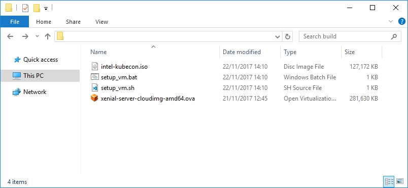
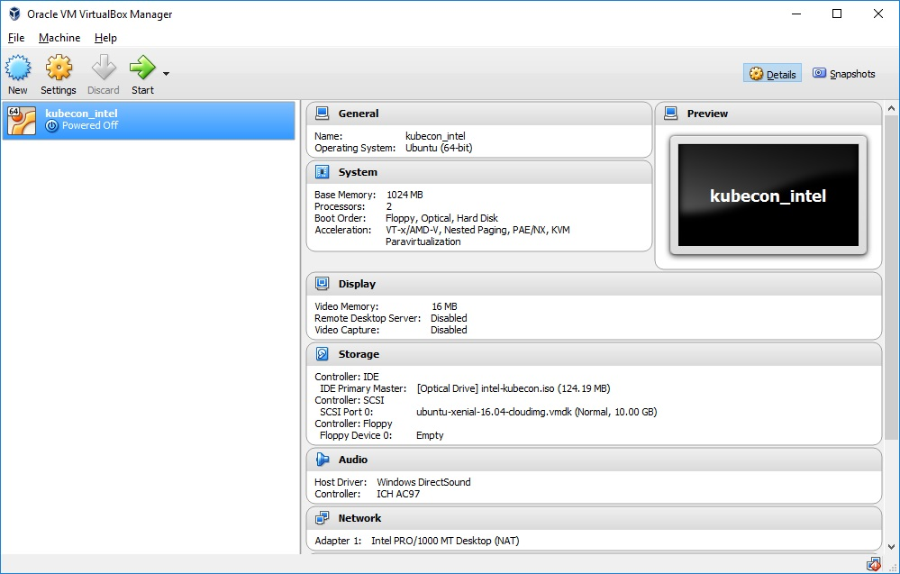
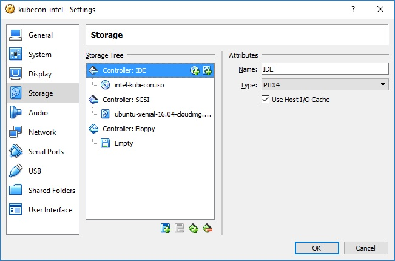
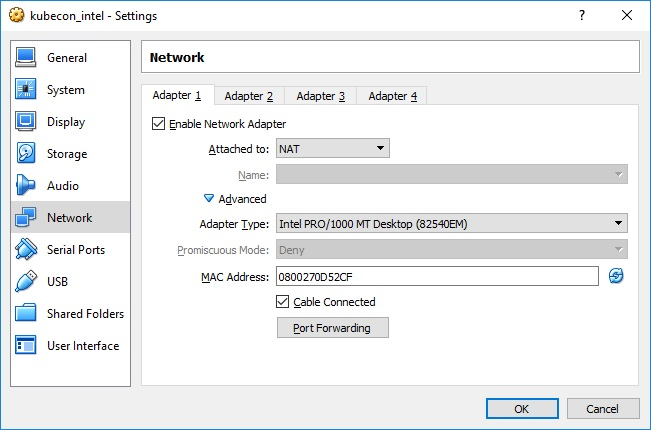
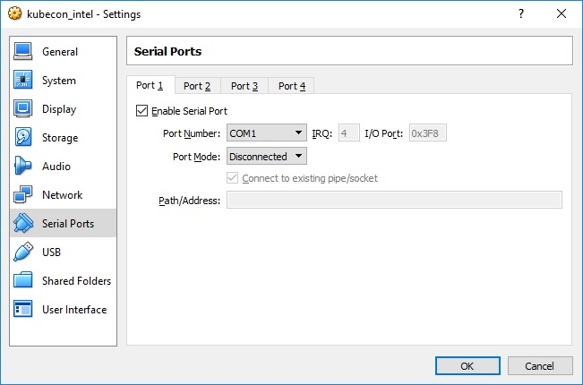

# Introduction

USB stick contains:
* `intel-kubecon.iso` disk image serving as a cloud-init configuration drive.
* Unmodified Ubuntu Server 16.04 LTS (Xenial Xerus) Cloud Image in Open Virtual Aliance (OVA) format obtained from https://cloud-images.ubuntu.com/xenial/current/.
* Scripts for automated VirtualBox VM setup: `setup_vm.bat` for Windows and `setup_vm.sh` for Linux distributions respectively.

# Installation

## Setting up VM

### Automated

1. Run `setup_vm.bat` on Windows or `setup_vm.sh` on Linux distributions and wait until the operation completes.

2. Open VirtualBox and start `kubecon_intel` virtual machine.

3. Press Enter key and login with **ubuntu/ubuntu** credentials.

### Manual
1. Open VirtualBox Manager. Select **File** -> **Import Appliance...**. Specify path to the `xenial-server-cloudimg-amd64.ova` file. Click **Next** and **Import**.

2. Wait for the process to complete.
3. Open **Settings** window for imported VM.
4. Go to the **Storage** tab and add the optical drive. Click the small CD icon with plus next in the **Controller: IDE** row, in the new window click **Choose disk** and choose `intel-kubecon.iso` file located on the USB stick.

5. Go to the **Network** tab and add set **Attached to:** in the **Adapter 1** tab to **NAT**. *Optionally you can also configure port forwarding to enable access to the VM via SSH*.

6. Go to the **Serial ports** tab. Tick **Enable serial port**. Default settings **COM1** and **Disconnected** are fine.

7. Save  changes by clicking **OK** button.
8. Start the VM. Press Enter key and login with **ubuntu/ubuntu** credentials.

## Installing software
1. (Optionally) Set proxy environment variables if needed:
```
export http_proxy=http://<server>:<port>
export https_proxy=https://<server>:<port>
```
2. Execute `setup.sh` script located in the **ubuntu** user home directory. Script will install install required packages and will clone GitHub repository with Ansible playbook to setup Kubernetes and other software components.
3. Run ansible-playbook commands to install Kubernetes and other software components following [this guide](https://github.com/intel/container-experience-kits-demo-area/blob/master/software/README.md#installation).

## Generating USB stick content

1. Run
```
make
```
in the `usb-stick` directory. This will:
* download the latest version of Ubuntu Server 16.04 LTS (Xenial Xerus) Cloud Image in OVA format from [here](https://cloud-images.ubuntu.com/xenial/current/).
* build `intel-kubecon.iso` cloud-init image
* copy scripts for automated VM import from `usb-stick/scripts` directory

2. All output files will be placed in the `usb-stick/build` directory. Additionally, .tar archive containing .ova image, scripts and cloud-init ISO will be created in the usb-stick directory.

3. To download and install VirtualBox platform go to [official download page](https://www.virtualbox.org/wiki/Downloads).

**Note**: To build cloud-init ISO only go to `usb-stick/iso` directory and run `make` command.

**Note**: `genisoimage` tool is required to generate `intel-kubecon.iso` image.

## Troubleshooting

**Error: VT-x is not available (VERR_VMX_NO_VMX) in VirtualBox.**

The **VT-x** or **Virtualization acceleration** (the name depends on the motherboard and may vary) option is disabled for the CPU in the local machine's BIOS and this is required since guest OS is 64-bit version of Ubuntu. Common workaround would be to enable the **VT-x** option in the local machine BIOS and restart the computer.