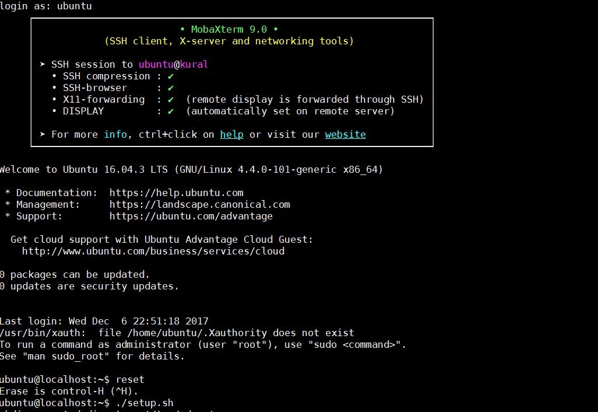
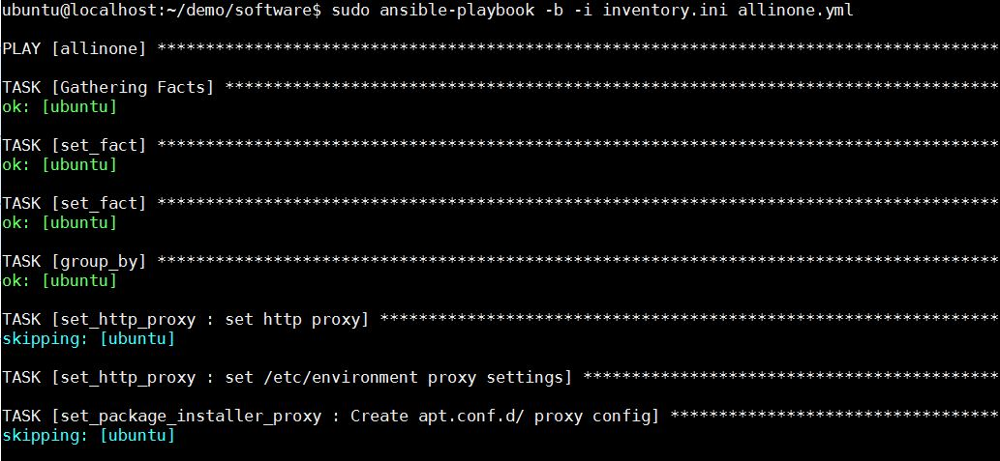
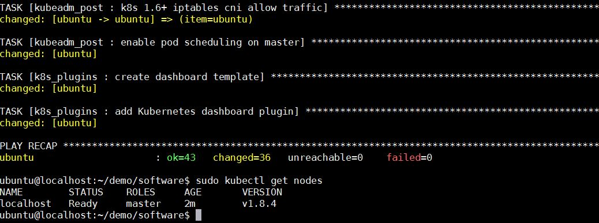
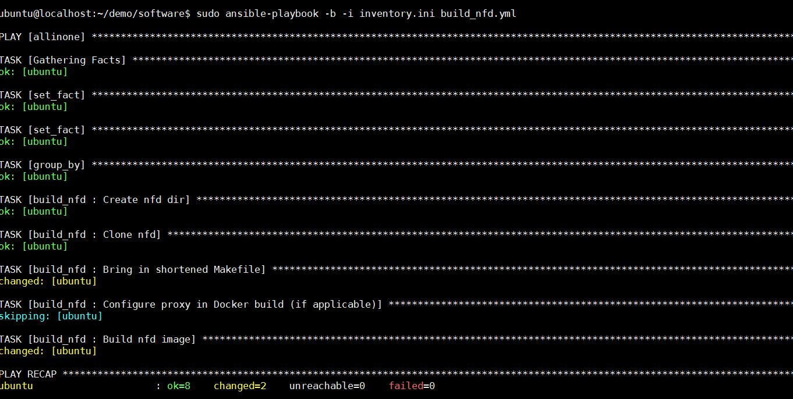
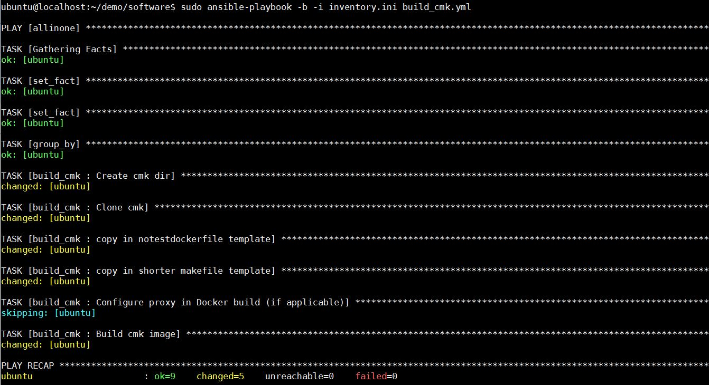

Demo Instruction
=================
Please follow the instructions as mentioned in the below sequences:
   * Pre-requisite
      * [VM setup](https://github.com/intel/container-experience-kits-demo-area/tree/master/usb-stick#setting-up-vm)
      * [Demo env](https://github.com/intel/container-experience-kits-demo-area/edit/master/workspace/README.md#demo-build-env-prep)
   * Demo details


## Demo env prep
**User with proxy setting refer the [proxy settings in the script](https://github.com/intel/container-experience-kits-demo-area/tree/master/software#deploying-kubernetes-with-proxy)**
1. Once login into the VM SSH session, install the ``setup.sh`` script, this script install the basic packages and clone the container-experience kit demo area repo.
```
ubuntu@localhost:~$ ./setup.sh
```


2. Execute the ``allinone.yml`` script to install the kubernetes cluster, with all reference plugin, flannel and Multus CNI
```
ubuntu@localhost:~/demo/software$ sudo ansible-playbook -b -i inventory.ini allinone.yml
```


**Execute the steps 3 and 4 in parallel**
3. Execute the ``build_nfd.yml`` script to build the Node feature discovery image
```
ubuntu@localhost:~/demo/software$ sudo ansible-playbook -b -i inventory.ini build_nfd.yml
```


4. Execute the ``build_cmk.yml`` script to build the CPU-Manager-for-Kubernetes(CMK) image
```
ubuntu@localhost:~/demo/software$ sudo ansible-playbook -b -i inventory.ini build_cmk.yml
```


## Demo details
1. Please follow the instruction in the respective project folder
      * [Multus](https://github.com/intel/container-experience-kits-demo-area/tree/master/workspace/multus#multus-cni-plugin)
      * [NFD](https://github.com/intel/container-experience-kits-demo-area/tree/master/workspace/nfd#demo-installation-with-ansible-script)
      * [CMK](https://github.com/intel/container-experience-kits-demo-area/tree/master/workspace/cmk#demo-installation-with-ansible-script)
      * SRIOV & DPDK - Video Demo
