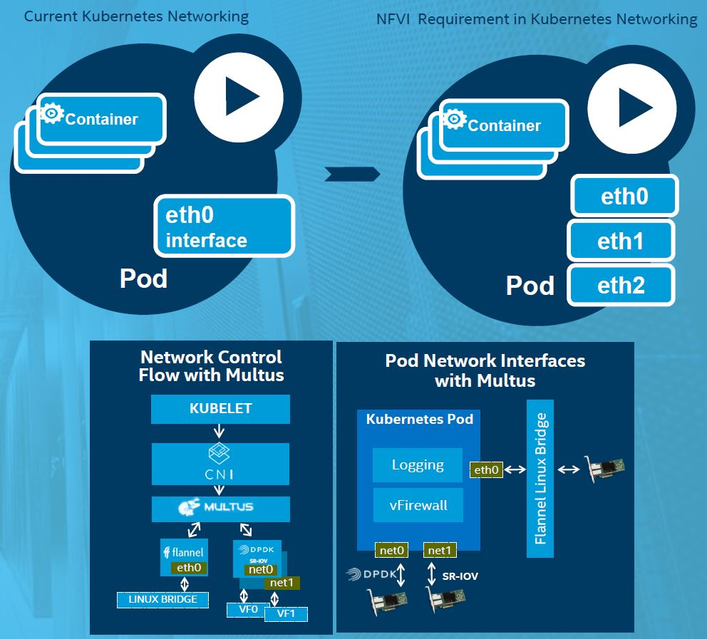

## MULTUS CNI plugin

- *Multus* is the latin word for “Multi”
- Multus is a container network interface (CNI) plugin specifically designed to provide support for multiple networking interfaces in a Kubernetes environment.

<p align="center">
   
</p>

- Figure above shows the network control flow with Multus. 
- When Multus is invoked, it recovers pod annotations related to Multus, in turn, then it uses these annotations to recover a Kubernetes custom resource definition (CRD), which is an object that informs which plugins to invoke and the configuration needing to be passed to them. The order of plugin invocation is important as is the identity of the master plugin.
- In the figure, we see the benefit in a virtual firewall (vFW) use case.
-- By using the [SRIOV CNI plugin](https://github.com/Intel-Corp/sriov-cni) in DPDK mode, the vFW can get full-speed line rate packet interfaces to the networks on which it is expected to perform its function. Additionally, there exists the management and control eth0 interface, which is available for control of the vFW itself and also possibly other functions, such as logging whose job may be to scrape the vFW logs and export via the management network interface to a centralized logging service. 

## Demo Installation with ansible script
- Multus is installed by default in the `allinone.yml` as explained in the [Deploying Kubernetes without Proxy](https://github.com/intel/container-experience-kits-demo-area/tree/master/software#deploying-kubernetes-without-proxy)

### Example usage
#### Creating “Network” third party resource in kubernetes

Multus is compatible to work with both CRD/TPR. Both CRD/TPR based network object api self link is same.

#### CRD based Network objects

1. Create a CRD “crdnetwork.yaml” for the network object as shown below
```
 # cd ~/demo/workspace/multus/
 # sudo kubectl create -f ./crd/crdnetwork.yaml
 customresourcedefinition "networks.kubernetes.com" created
```
2. create the custom resource definition network objects
```
# sudo kubectl create -f ./network-obj/flannel-network.yaml
network "flannel-conf" created
# sudo kubectl create -f ./network-obj/ptp-network.yaml
network "ptp-conf" created
```
3. Display the custom network object as below
```
# sudo kubectl get networks
NAME           AGE
flannel-conf   3m
ptp-conf       3m
```

#### Configuring Pod to use the CDR Network objects
1. Look at the pod netwok annotation field. In this case flannel-conf network object act as the primary network. 
```
# cat pod/pod-multi-network.yaml
apiVersion: v1
kind: Pod
metadata:
  name: multus-multi-net-poc
  annotations:
    networks: '[
        { "name": "flannel-conf" },
        { "name": "ptp-conf"}
    ]'
spec:  # specification of the pod's contents
  containers:
  - name: multus-multi-net-poc
    image: "busybox"
    command: ["top"]
    stdin: true
    tty: true
```
3.	Create Multiple network based pod from the master node
```
#sudo kubectl create -f ./pod/pod-multi-network.yaml
pod "multus-multi-net-poc" created
```
4.	Get the details of the running pod from the master
```
$ sudo kubectl get pod multus-multi-net-poc
NAME                   READY     STATUS    RESTARTS   AGE
multus-multi-net-poc   1/1       Running   0          2m
```
### Verifying Pod network
1.	Run “ifconfig” command inside the pod, `eth0` interfacce is from `flannel-conf`  and `net0` is from `ptp-conf` Network object.
```
$ sudo kubectl exec -it multus-multi-net-poc -- ifconfig
eth0      Link encap:Ethernet  HWaddr 0A:58:0A:F4:00:04
          inet addr:10.244.0.4  Bcast:0.0.0.0  Mask:255.255.255.0
          inet6 addr: fe80::4c2b:68ff:fee8:ad3d/64 Scope:Link
          UP BROADCAST RUNNING MULTICAST  MTU:1450  Metric:1
          RX packets:11 errors:0 dropped:0 overruns:0 frame:0
          TX packets:9 errors:0 dropped:0 overruns:0 carrier:0
          collisions:0 txqueuelen:0
          RX bytes:870 (870.0 B)  TX bytes:738 (738.0 B)

lo        Link encap:Local Loopback
          inet addr:127.0.0.1  Mask:255.0.0.0
          inet6 addr: ::1/128 Scope:Host
          UP LOOPBACK RUNNING  MTU:65536  Metric:1
          RX packets:0 errors:0 dropped:0 overruns:0 frame:0
          TX packets:0 errors:0 dropped:0 overruns:0 carrier:0
          collisions:0 txqueuelen:1
          RX bytes:0 (0.0 B)  TX bytes:0 (0.0 B)

net0      Link encap:Ethernet  HWaddr 0A:58:0A:A8:01:0B
          inet addr:10.168.1.11  Bcast:0.0.0.0  Mask:255.255.255.0
          inet6 addr: fe80::e4d6:f8ff:fed6:2300/64 Scope:Link
          UP BROADCAST RUNNING MULTICAST  MTU:1500  Metric:1
          RX packets:8 errors:0 dropped:0 overruns:0 frame:0
          TX packets:8 errors:0 dropped:0 overruns:0 carrier:0
          collisions:0 txqueuelen:0
          RX bytes:648 (648.0 B)  TX bytes:648 (648.0 B)
```

